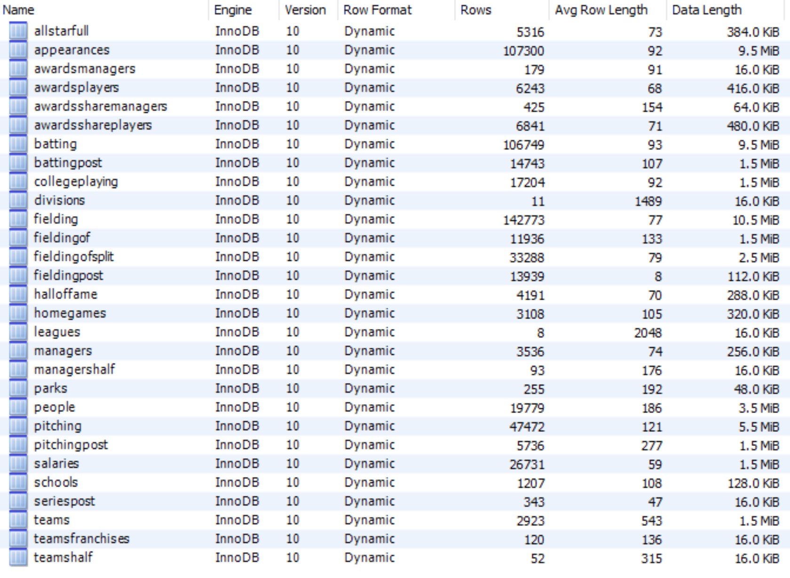
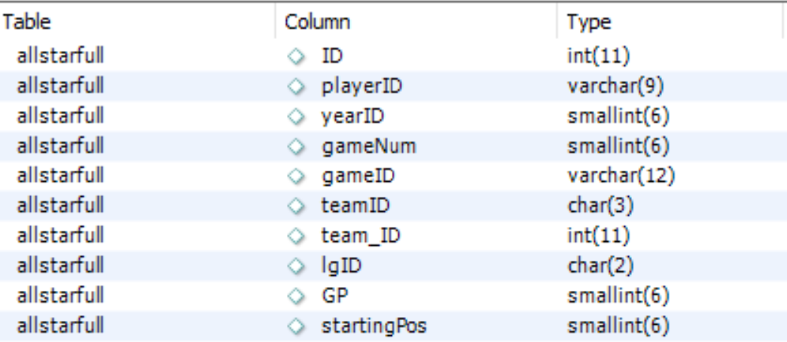
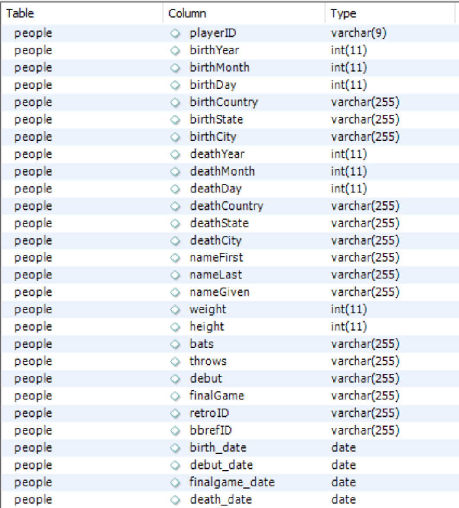
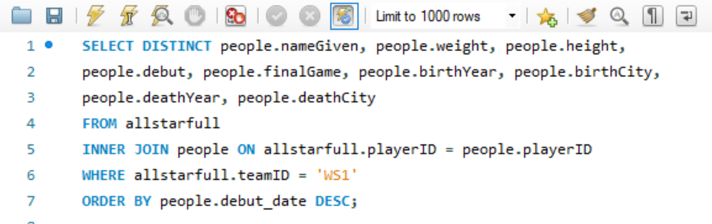
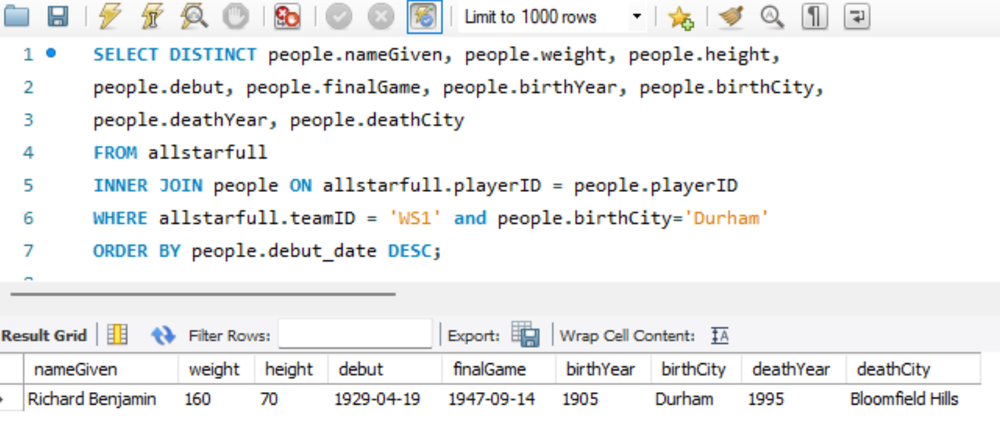

# Mini Prject 6, Complex MySQL Query

## Database setup
- Used MariaDB to local host MySQL database connection
- Used MySQL Workbench to query and view database
- Downloaded and Imported Lahman's baseball dataset from https://github.com/WebucatorTraining/lahman-baseball-mysql.git

## Database Structure
- The database is full of a lot of different tables for various baseball statistics.


- For my query I used the allstar table showing various players who made the all start team as well as the people table with data on those players.



## Query
- For my query I found various personal data for all of the players who represented Washington at the Allstar game sorted by their debut date.

### Steps
- ```SQL SELECT DISTINCT people.nameGiven, people.weight, people.height, people.debut, people.finalGame, people.birthYear, people.birthCity, people.deathYear, people.deathCity```
    - These are the columns that represent the players life and therefore I selected those to return. Used DISTINCT to not keep repeated allstars

- ```FROM allstarfull INNER JOIN people ON allstarfull.playerID = people.playerID```
    - I wanted to query on the allstarfull but get people data so used INNER JOIN to combine the playerdata to their allstar appearences based on matching playerIDs.
- ```WHERE allstarfull.teamID = 'WS1'```
    - This WHERE block is where I can specify which rows to keep. I chose to find the players who played for Washington when they were an all star. 
- ```ORDER BY people.debut_date DESC;```
    - Finally I order the results based on the debut date of the player with the most recent at the top.

### Results
- The results of the query are the [Name, weight, heighy, debut date, finalgame date, birth year, birth city, death year, and death city] for all of the players who represented Washington at an allstar game in the database.
    - Found at query_results.csv
- I noticed that there was one player who was born in Durham and represented Washington at an all star game so I decided to make that specific query by modifing Where to ```WHERE allstarfull.teamID = 'WS1' and people.birthCity = 'Durham``` resulting in Richard Benjamin
    - 